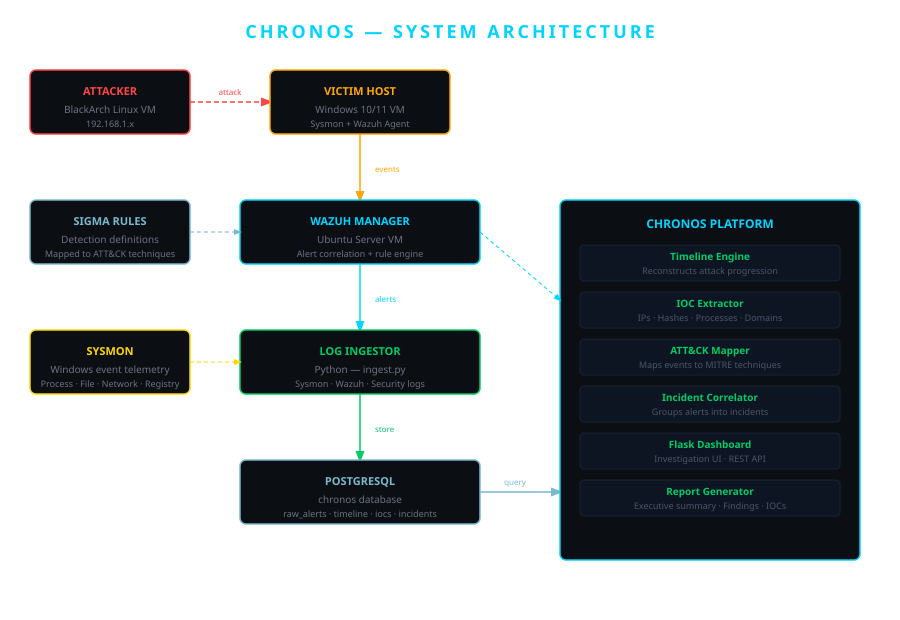

# Chronos
### Security Timeline Reconstruction & Incident Investigation Platform


Chronos is a DFIR-focused platform that ingests raw security telemetry, reconstructs attack timelines, extracts indicators of compromise, maps evidence to MITRE ATT&CK techniques, and presents everything through a professional investigation dashboard.

Built without LLMs or AI APIs — all correlation, mapping, and reconstruction logic is deterministic, evidence-based Python.

---

## What It Does

Most detection engineering projects answer: **did the alert fire?**

Chronos answers: **what happened after the alert fired?**

Given raw Sysmon events, Wazuh alerts, and Windows Security logs, Chronos reconstructs the full attack story — from initial access to lateral movement — as an investigable incident with a timeline, IOCs, and ATT&CK coverage map.

---

## Architecture



| Component | Technology |
|---|---|
| Attacker VM | BlackArch Linux |
| Victim VM | Windows 10/11 + Sysmon + Wazuh Agent |
| SIEM | Wazuh Manager (Ubuntu Server) |
| Database | PostgreSQL |
| Backend | Python 3, Flask, SQLAlchemy |
| Frontend | Bootstrap 5, Chart.js |
| Detection | Sigma rules mapped to ATT&CK |

---

## Core Modules

### 1. Log Ingestor
Collects Sysmon XML events, Wazuh JSON alerts, and Windows Security logs. Normalizes and stores them in PostgreSQL across `raw_alerts`, `process_events`, `file_events`, and `network_events` tables.

### 2. Timeline Engine
The heart of the project. Converts raw telemetry into a chronological attack progression, identifying pivot events — moments where attacker behavior changed or escalated. Each event carries a confidence score and ATT&CK technique mapping.

### 3. IOC Extractor
Automatically identifies indicators from telemetry: file hashes (MD5/SHA256), process names, IP addresses, domains, usernames, and hostnames. Tracks hit counts and first/last seen timestamps.

### 4. ATT&CK Mapper
Maps timeline events to MITRE ATT&CK techniques using Sigma rule metadata and behavioral heuristics. Produces a per-incident technique coverage table with pivot counts.

### 5. Incident Correlator
Groups related alerts, processes, and IOCs into a single incident object. Instead of showing 840 raw alerts, it presents 1 incident containing everything linked to that intrusion.

### 6. Flask Dashboard
A dark-themed investigation UI with four views:
- **Dashboard** — incident overview with live stats
- **Incident** — timeline, ATT&CK map, IOCs, affected hosts
- **Alerts** — full raw alert feed with severity and MITRE tags
- **IOCs** — deduplicated indicator list with hit counts

---

## Lab Environment

BlackArch Linux VM  (Attacker)
|
| simulated attack traffic
v
Windows 10/11 VM   (Victim)

Sysmon v15
Wazuh Agent 4.x
|
| event forwarding
v
Ubuntu Server VM   (Detection + Analysis)
Wazuh Manager
PostgreSQL
Chronos Platform (Flask :5000)

---

## Attack Scenarios Tested

| Technique | ATT&CK ID | Description |
|---|---|---|
| Scheduled Task Persistence | T1053.005 | schtasks.exe persistence via Office hook |
| Ingress Tool Transfer | T1105 | PowerShell writing PS1 to SystemTemp |
| Process Discovery | T1057 | net.exe accounts enumeration |
| Account Discovery | T1087 | Local account enumeration |
| Process Injection | T1055 | Suspicious process ancestry |
| Security Software Discovery | T1518 | SecEdit.exe config export |
| Command & Scripting | T1059 | Abnormal cmd.exe child processes |

---

## Dashboard Screenshots

| View | Description |
|---|---|
|  | Main incident overview with live stats |
|  | Timeline reconstruction with ATT&CK mapping |
|  | Raw alert feed with severity classification |
|  | Extracted indicators of compromise |

---

## Running Chronos

### Prerequisites
- Python 3.10+
- PostgreSQL 15
- Wazuh Manager (for live ingestion)

### Setup

```bash
git clone https://github.com/yourusername/chronos
cd chronos
pip install -r requirements.txt
```

Configure database connection:
```bash
export DB_HOST=localhost
export DB_NAME=chronos
export DB_USER=chronos
export DB_PASS=yourpassword
```

Run the dashboard:
```bash
cd dashboard
python app.py
```

Access at `http://localhost:5000`

---

## Project Philosophy

This project was built to demonstrate that a student can build serious DFIR tooling — not just detections.

No Claude API. No ChatGPT. No LLMs.

Every correlation, every timeline reconstruction, every IOC extraction is deterministic logic written in Python — the same way real SOC and DFIR tools work.

---

## Skills Demonstrated

- Digital Forensics & Incident Response (DFIR)
- Security telemetry ingestion and normalization
- Attack timeline reconstruction from raw events
- IOC extraction and deduplication
- MITRE ATT&CK technique mapping
- Sigma rule integration
- Full-stack security tooling (Python + Flask + PostgreSQL)
- Detection Engineering
- Threat Hunting methodology

---

## Author

**Fernando** — Cybersecurity student specializing in Detection Engineering, SOC Operations, and DFIR.

> *"This student can investigate intrusions, reconstruct attack timelines, correlate telemetry, understand ATT&CK, and build security tooling that resembles what real SOC and DFIR teams use."*
