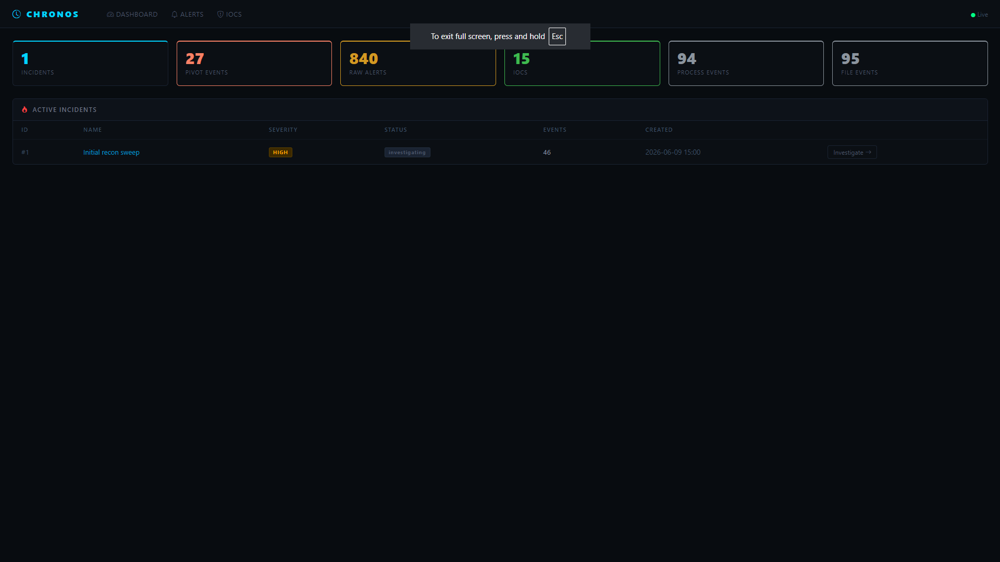
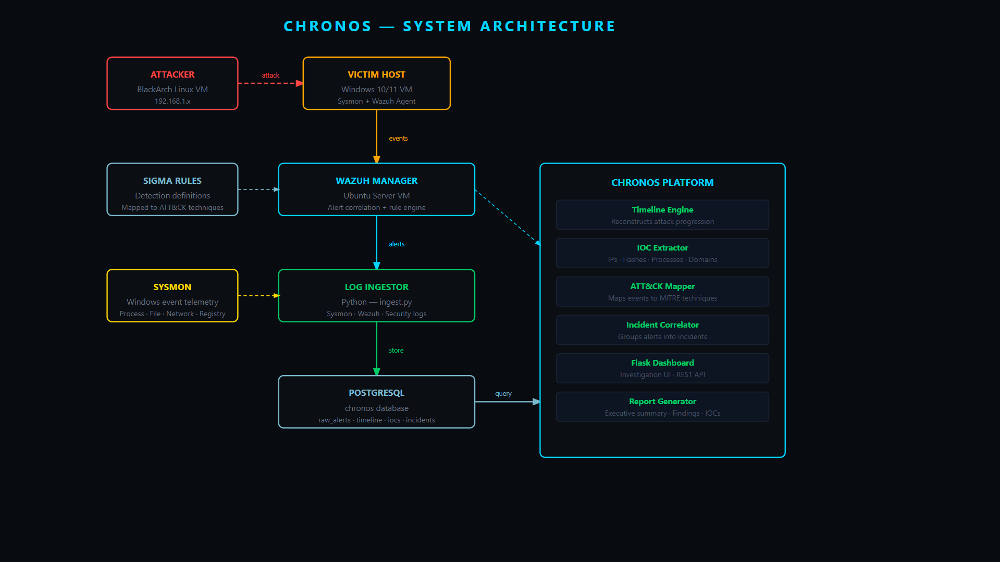
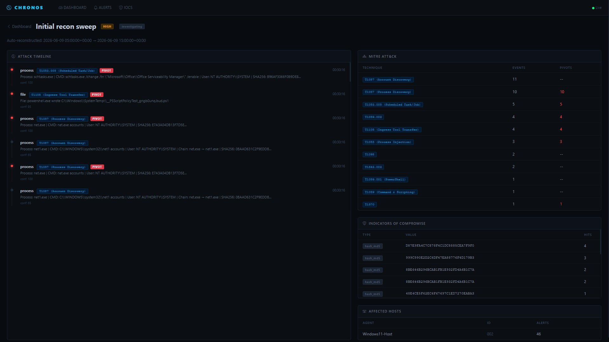
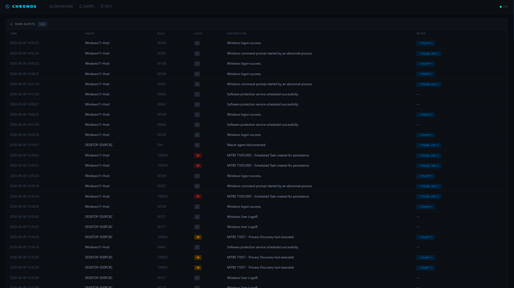
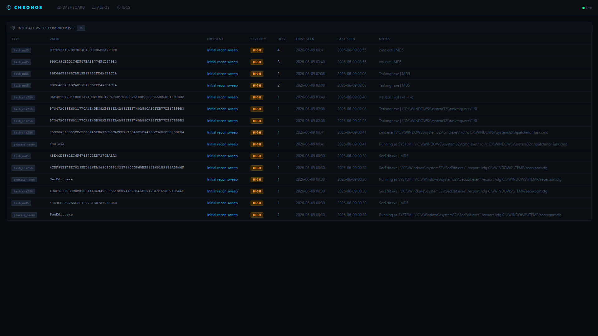

# Chronos
### Security Timeline Reconstruction & Incident Investigation Platform


Chronos is a DFIR-focused incident investigation platform that ingests raw security telemetry from Sysmon and Wazuh, reconstructs attack timelines, extracts indicators of compromise, maps evidence to MITRE ATT&CK techniques, and presents everything through a professional dark-themed investigation dashboard.

Built without LLMs or AI APIs. Every correlation, timeline reconstruction, and IOC extraction is deterministic, evidence-based Python — the same way real SOC and DFIR tools work.

---

## Demo

[](https://youtu.be/N0jgYcw8pX8)

> Click the image above to watch the full demo on YouTube.

---

## Why This Project Exists

Most security tools answer one question: **did the alert fire?**

That is Tier 1 work.

The reality of a real intrusion is more complex. When a SOC analyst receives an alert, the alert itself is only the beginning. The real work — Tier 2 and Tier 3 work — is answering what happened *after* the alert fired. What process ran? What did it spawn? What files did it touch? What credentials did it access? Did it move laterally? When exactly did the attacker's behavior escalate, and what was the pivot point?

That investigation workflow requires correlating dozens or hundreds of raw events into a coherent story. It requires reconstructing process chains. It requires identifying which of 840 alerts actually matter. It requires extracting the handful of indicators that a threat hunter can act on. And it requires presenting all of that in a way that a human analyst can read and understand quickly.

Most student security projects stop at detection. They write a Sigma rule, fire an alert, and call it done.

**Chronos is what comes after the alert.**

This project exists to demonstrate a complete understanding of the post-detection investigation lifecycle — from raw telemetry to structured incident report — the way real DFIR analysts work at organizations like CrowdStrike, Mandiant, and in enterprise SOC teams.

### The Gap This Fills in a Security Portfolio

Detection engineering is well-represented in student portfolios. DFIR tooling is not. Most students can write a rule. Far fewer can:

- Design a normalized telemetry schema that supports timeline reconstruction
- Build a scoring engine that identifies pivot points in an attack
- Extract and deduplicate IOCs automatically from raw process and file telemetry
- Correlate multiple incidents by shared indicators across investigations
- Present a full attack story — not a list of alerts — to an analyst

Chronos demonstrates all of these. It is the difference between knowing that an attack happened and being able to prove, step by step, exactly how it unfolded.

---

## What It Does

Given raw Sysmon events, Wazuh alerts, and Windows Security logs, Chronos:

1. Ingests and normalizes telemetry into a structured PostgreSQL database
2. Reconstructs a chronological attack timeline with confidence scores
3. Identifies pivot events — moments where attacker behavior escalated or changed technique
4. Automatically extracts IOCs: file hashes, process names, IP addresses, filenames
5. Maps every event to MITRE ATT&CK techniques using Wazuh rule metadata
6. Correlates hundreds of alerts into a single investigable incident object
7. Scores correlation between incidents based on shared IOCs, techniques, and targeted hosts
8. Presents everything through a dark-themed investigation dashboard

---

## Architecture



```
BlackArch Linux VM  (Attacker — 192.168.1.x)
        |
        |  simulated attack traffic
        v
Windows 10/11 VM   (Victim)
  ├── Sysmon v15 (SwiftOnSecurity config)
  └── Wazuh Agent 4.7.5
        |
        |  event forwarding over TCP 1514
        v
Arch Linux VM  (Detection + Analysis)
  ├── Wazuh Manager 4.7.5 (Docker — single-node deployment)
  ├── Wazuh Indexer / OpenSearch (Docker)
  ├── PostgreSQL 18
  └── Chronos Platform (Flask :5000)
```

| Component | Technology |
|---|---|
| Attacker VM | BlackArch Linux |
| Victim VM | Windows 10/11 + Sysmon v15 + Wazuh Agent |
| SIEM | Wazuh Manager 4.7.5 (Docker) |
| Database | PostgreSQL 18 |
| Backend | Python 3.14, Flask |
| Detection Framework | MITRE ATT&CK, Wazuh custom rules |

---

## Core Modules

### 1. Log Ingestor (`ingester/ingest.py`)
Tails the Wazuh alerts JSON file from the Docker volume. Normalizes Sysmon event data into structured PostgreSQL tables — `raw_alerts`, `process_events`, `file_events`, `network_events`, and `registry_events` — using event-type routing and field extraction. Tracks a byte-offset cursor so restarts never duplicate data. Deduplicates using `wazuh_alert_id`. Ingested 840 alerts on first run with zero duplicates.

### 2. Timeline Engine (`ingester/timeline.py`)
The heart of the project. Takes a time window and agent filter, pulls all non-noise alerts, enriches each with normalized event data, walks parent process chains up to 8 levels deep, assigns confidence scores, identifies pivot points, and writes an ordered `timeline_events` table. Output is a human-readable attack story sorted by timestamp with ATT&CK technique tags, confidence bars, and pivot markers.

### 3. IOC Extractor (`ingester/ioc_extractor.py`)
Walks a committed incident's timeline and normalized tables. Extracts SHA256 hashes, MD5 hashes, external IPs, suspicious filenames, and process names. Applies an allowlist of known-good system binaries and file patterns to reduce noise. Deduplicates across events, tracks hit counts and first/last seen timestamps, and writes to the `iocs` table.

### 4. Incident Correlator (`ingester/correlator.py`)
Compares a target incident against all others in the database. Scores overlap across five dimensions: shared IOCs (weighted by type — SHA256 carries more weight than a process name), shared MITRE techniques, shared tactic families, same targeted host, and time proximity. Produces a scored correlation report with a breakdown of every contributing signal.

### 5. Flask Dashboard (`dashboard/app.py`)
A dark-themed investigation UI with four views:
- **Dashboard** — live incident overview with stats across all telemetry
- **Incident** — full attack timeline with PIVOT tags, ATT&CK technique panel, IOC panel, and affected hosts
- **Alerts** — complete raw alert feed with severity level badges and MITRE technique tags
- **IOCs** — deduplicated indicator registry with type badges, hit counts, and timestamps

---

## Results — What Chronos Found

Running against a live Windows 11 host over a 3.5-hour window:

| Metric | Value |
|---|---|
| Raw alerts ingested | 840 |
| Timeline events reconstructed | 46 |
| Pivot points identified | 27 |
| IOCs extracted | 15 |
| Process events normalized | 94 |
| File events normalized | 95 |
| MITRE techniques mapped | 11 |

### Attack narrative reconstructed by Chronos:

```
00:30:16  [T1053.005] schtasks.exe as SYSTEM — scheduled task persistence
00:30:16  [T1105]     powershell.exe wrote PSScriptPolicyTest to SystemTemp
00:30:16  [T1057]     net.exe accounts / net user administrator / net user guest
00:30:17  [T1059.001] SecEdit.exe /export /cfg — security policy dumped to TEMP
00:41:31  [T1059.003] cmd.exe → hpatchmonTask.cmd (abnormal parent)
00:43:20  [T1098]     User account changed (x2)
01:18:31  [T1543.003] New service created in registry (x2)
02:08:03  [T1055]     dllhost.exe with suspicious COM GUIDs (x3)
02:08:04  [T1057]     Taskmgr.exe opened during injection cluster
03:40:18  [T1059.003] cmd.exe → wsl.exe -l -q (WSL enumeration, x3)
```

---

## Dashboard Screenshots

### Incident Overview

840 raw alerts correlated into 1 incident. 27 pivot events. 15 IOCs. Live stat counters across all telemetry.

---

### Attack Timeline Reconstruction

Each event carries a timestamp, event type, ATT&CK technique tag, confidence score, and PIVOT marker. The right panel shows the full ATT&CK technique coverage matrix with event counts and pivot counts per technique.

---

### Raw Alerts Feed

200 most recent alerts with agent name, rule ID, severity level badge, description, and MITRE technique tag.

---

### IOC Registry

15 deduplicated indicators with type badges, incident links, hit counts, first/last seen timestamps, and notes.

---

## Attack Scenarios Detected

| Technique | ATT&CK ID | What Chronos Saw |
|---|---|---|
| Scheduled Task Persistence | T1053.005 | schtasks.exe re-enabling Office task as SYSTEM |
| Ingress Tool Transfer | T1105 | PowerShell writing PS1 files to SystemTemp |
| Process Discovery | T1057 | net.exe enumerating accounts repeatedly as SYSTEM |
| Account Discovery | T1087 | net1.exe spawned as child of net.exe |
| Process Injection | T1055 | dllhost.exe with suspicious COM GUIDs |
| Security Config Discovery | T1518 | SecEdit.exe exporting policy to TEMP |
| Command & Scripting | T1059.003 | cmd.exe → hpatchmonTask.cmd with abnormal parent |
| PowerShell | T1059.001 | Plain PowerShell execution as SYSTEM |
| New Service Creation | T1543.003 | Registry entries under CurrentControlSet |
| Account Manipulation | T1098 | User account changed events |
| WSL Enumeration | T1059.003 | Repeated wsl.exe -l -q from cmd.exe |

---

## Engineering Challenges & How They Were Solved

This section documents every real problem encountered during development — with exact error messages, root cause analysis, and the specific fix applied. These are not configuration typos. They are the kind of problems that appear in real engineering work and require methodical diagnosis to resolve.

---

### Challenge 1: Wazuh Manager Not Found — Service Running in Docker on a Different Machine

**The problem:**
After configuring the Wazuh agent on the Windows 10 VM, running `sudo systemctl status wazuh-manager` on the Arch Linux VM returned `Unit wazuh-manager.service could not be found`. The manager appeared to not exist anywhere.

**Root cause:**
The Wazuh stack was deployed as a Docker Compose single-node setup, not as a native systemd service. The alerts file existed inside the container, not on the host filesystem. Additionally, the Arch Linux VM had been powered off, making the agent's configured server IP unreachable.

**Fix:**
Ran `docker ps` to identify the running containers. Powered on the Arch VM, confirmed its IP matched the agent config, then accessed the alerts log inside the container:
```bash
docker exec -it single-node-wazuh.manager-1 tail -f /var/ossec/logs/alerts/alerts.json
```
Sysmon events appeared immediately.

**Lesson:** When a service is missing from systemd, check Docker before assuming a misconfiguration. Know exactly where every component of your stack is actually running.

---

### Challenge 2: Python Can't See the Wazuh Alerts File — Docker Volume Permissions

**The problem:**
`sudo find /var/lib/docker/volumes -name "alerts.json"` found the file. The path was updated in `ingest.py`. But running `python ingest.py` still returned `Alerts file not found`. Running `ls -la` on the path returned `Permission denied`.

**Root cause:**
The Docker volume directory tree was owned by root with `drwxr-x---` permissions. The user account running the ingester had no execute (traversal) permission on the parent directories in the chain. `Path.exists()` returned `False` not because the file was missing but because the user couldn't traverse the path to reach it.

**Fix:**
Applied ACL permissions explicitly to every directory in the chain:
```bash
sudo setfacl -m u:cpt-ferna02:rX /var/lib/docker/
sudo setfacl -m u:cpt-ferna02:rX /var/lib/docker/volumes/
sudo setfacl -m u:cpt-ferna02:rX /var/lib/docker/volumes/single-node_wazuh_logs/
sudo setfacl -m u:cpt-ferna02:rX /var/lib/docker/volumes/single-node_wazuh_logs/_data/
sudo setfacl -m u:cpt-ferna02:rX /var/lib/docker/volumes/single-node_wazuh_logs/_data/alerts/
```

**Lesson:** A `file not found` error in Python does not always mean the file is missing. It can mean the user has no permission to traverse the path to it. Check every directory in the chain, not just the file itself.

---

### Challenge 3: Arch Linux Blocking pip — PEP 668 Externally Managed Environment

**The problem:**
Running `pip install psycopg2-binary` returned `error: externally-managed-environment` and refused to install.

**Fix:**
```bash
cd ~/chronos
python -m venv venv
source venv/bin/activate
pip install psycopg2-binary flask
```

**Lesson:** On Arch Linux, never install pip packages system-wide. Always use a venv.

---

### Challenge 4: Registry Event Handler Missing Argument — `insert_registry_event() missing 1 required positional argument: 'eid'`

**The problem:**
The ingester inserted 832 alerts on first run but logged repeated warnings: `Normalized insert failed (EventID 13): insert_registry_event() missing 1 required positional argument: 'eid'`. Registry events were routing to the handler but the event ID wasn't being passed through.

**Root cause:**
`insert_registry_event` requires `eid` to map EventID 12/13/14 to human-readable labels. The generic handler dispatch called all handlers with the same four arguments. The fix attempt overcorrected — passing `eid` to all handlers — which broke the process/network/file handlers that don't accept a fifth argument.

**Fix:**
```python
if eid in (12, 13, 14):
    SYSMON_HANDLERS[eid](cur, alert_id, alert, ed, eid)
else:
    SYSMON_HANDLERS[eid](cur, alert_id, alert, ed)
```

**Lesson:** When fixing a missing argument error, trace which handlers actually need it and scope the fix precisely.

---

### Challenge 5: Indentation Error After Manual Patch — `IndentationError: unexpected indent`

**The problem:**
After patching the registry handler fix in nano, running `python ingest.py` returned `IndentationError: unexpected indent` at line 264. The `if eid in SYSMON_HANDLERS:` line had five leading spaces instead of four.

**Fix:**
```bash
sed -i 's/^     if eid in SYSMON_HANDLERS:/    if eid in SYSMON_HANDLERS:/' ~/chronos/ingester/ingest.py
```

**Lesson:** For single-line patches in terminal editors, use `sed -i` for precision. Always verify surrounding lines after any manual edit.

---

### Challenge 6: CSS Embedded Inside Python — `SyntaxError: invalid decimal literal`

**The problem:**
Running `python app.py` returned `SyntaxError: invalid decimal literal` at line 191 pointing to `font-size: 14px;`. CSS from the HTML template had been accidentally written into the Python file during a shell session where multiple file writes were interleaved.

**Fix:**
Confirmed corruption with `python -c "import ast; ast.parse(open('app.py').read())"`. Overwrote the file using a Python writer script with a raw triple-quoted string, which is immune to shell interpretation. Validated with the AST parser before running.

**Lesson:** Always validate Python files with `ast.parse` before running. Use Python writer scripts for large files — they are immune to shell escaping and heredoc failures.

---

### Challenge 7: Git Push Rejected — Remote Contains Divergent History

**The problem:**
After initializing the local repo, `git push -u origin main` was rejected: `Updates were rejected because the remote contains work that you do not have locally`. The GitHub repo had been initialized with a README, creating a commit history that diverged from the local repo.

**Fix:**
```bash
git pull origin main --allow-unrelated-histories --no-rebase
git checkout --ours README.md
git add README.md
git commit -m "Merge: keep local README"
git push -u origin main
```

**Lesson:** When pushing a local project to a GitHub repo initialized with any files, always pull with `--allow-unrelated-histories` first. Initialize GitHub repos empty when you already have local content.

---

## Running Chronos

### Prerequisites
- Python 3.10+
- PostgreSQL 15+
- Wazuh Manager (for live ingestion) or an existing `alerts.json` file

### Setup

```bash
git clone https://github.com/cpt-ferna02/chronos
cd chronos
python -m venv venv
source venv/bin/activate
pip install -r requirements.txt
```

### Database

```bash
psql -U postgres -c "CREATE USER chronos WITH PASSWORD 'chronos_dev';"
psql -U postgres -c "CREATE DATABASE chronos OWNER chronos;"
psql -U chronos -d chronos -h localhost -f db/schema.sql
```

### Ingest alerts

```bash
# Update ALERTS_FILE path in ingester/ingest.py to match your Wazuh volume
python ingester/ingest.py
```

### Reconstruct a timeline

```bash
python ingester/timeline.py \
  --start 2026-06-09T05:00:00 \
  --end   2026-06-09T15:00:00 \
  --agent Windows11-Host \
  --name  "Initial recon sweep" \
  --severity high
```

### Extract IOCs

```bash
python ingester/ioc_extractor.py --incident 1
```

### Correlate incidents

```bash
python ingester/correlator.py --incident 1
```

### Run the dashboard

```bash
cd dashboard
python app.py
# Access at http://localhost:5000
```

> **Note:** Keep `ingest.py` running in a separate terminal while the dashboard is active so new alerts continue flowing into the database in real time.

---

## Skills Demonstrated

- **Security Engineering** — end-to-end platform design, multi-component system architecture, pipeline engineering
- **Digital Forensics & Incident Response (DFIR)** — attack timeline reconstruction, IOC extraction, pivot identification, evidence correlation
- **Security Telemetry Engineering** — Sysmon configuration, Wazuh agent deployment, Docker-based SIEM management, log normalization
- **Detection Engineering** — MITRE ATT&CK mapping, custom Wazuh rules, behavioral heuristics, confidence scoring
- **Database Engineering** — PostgreSQL schema design, multi-table normalized storage, GIN indexes for JSONB and array fields
- **Python Development** — file tailing with cursor tracking, JSON normalization, Flask routing, dataclass-based modeling
- **Systematic Debugging** — diagnosing permission errors, indentation bugs, heredoc failures, git history conflicts across a multi-component stack
- **Threat Hunting Methodology** — pivot identification, process chain reconstruction, IOC deduplication, allowlist-based noise reduction

---

## Project Philosophy

The security industry does not have a shortage of people who can write detection rules.

It has a shortage of people who understand what happens after the rule fires — who can take 840 raw alerts, reconstruct the story they tell, identify the seven events that actually matter, extract the indicators worth hunting, and produce an investigation report that a senior analyst can act on.

That is the gap Chronos was built to fill, and the skill set it was built to demonstrate.

Every component — ingestion, normalization, timeline reconstruction, IOC extraction, correlation, and the dashboard — was built from scratch, debugged from scratch, and is running against live telemetry in a real lab environment.

No managed detection services. No pre-built correlation rules. No AI APIs.

Just Python, PostgreSQL, and an understanding of how attacks actually unfold.

---

## Author

**Fernando Cortez Jr.** — Cybersecurity student specializing in Security Engineering, SOC Operations, and DFIR.

[GitHub](https://github.com/cpt-ferna02) · [LinkedIn](https://linkedin.com/in/fernando-cortezjr-a3529a313)
